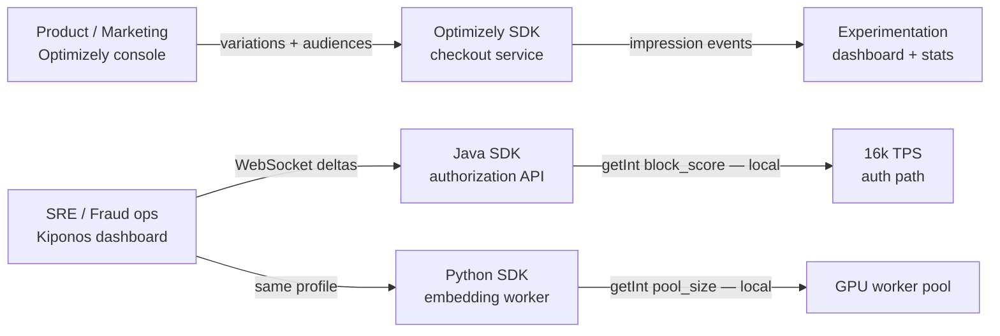

Thursday 10:47. The growth team ships a **full-stack checkout experiment** in Optimizely Feature Experimentation — variation `checkout_v3_simplified`, 12% traffic, sequential testing enabled, conversion metrics wired to the experimentation dashboard. Same war room, the card-acquiring partner reports elevated decline codes: the payments SRE needs `failure_rate_threshold` at 22, `fraud.block_score` at 76, and the Python embedding service needs `worker_pool_size` cut from 56 to 20 before GPUs throw CUDA OOM.

The experimentation lead asks:

> "Optimizely has **feature variables** — put the circuit threshold in a variable. One platform, one SDK, statistically governed."

The platform lead on authorization pushes back:

> "Optimizely is built for **which users enter the variation** and **whether we can call the test**. Our auth path runs **16k evaluations per second** for floats that change during incidents — not for cohort assignment with impression tracking."

[Optimizely](https://www.optimizely.com/products/feature-experimentation/) is a strong **enterprise experimentation platform** — statistically rigorous A/B tests, full-stack feature flags, audience targeting, and governance that marketing and product teams trust. [Kiponos.io](https://kiponos.io) is a **live operational config hub** — nested trees, WebSocket deltas, and local `get*()` reads in Java and Python on the money path. Mature enterprises use Optimizely where experiments need statistical rigor; Kiponos where production survives processor brownouts and fraud spikes.

## The problem — experiment variable semantics on the authorization hot path

Typical Optimizely integration for a product experiment:

```java
// Product path — correct use of Optimizely
OptimizelyUserContext user = optimizely.createUserContext(customerId);
OptimizelyDecision decision = user.decide("checkout_v3_simplified");
boolean useSimplifiedCheckout = decision.getEnabled();
```

Teams then extend feature variables for ops:

```java
// Anti-pattern — ops float stuffed into experimentation infrastructure
OptimizelyUserContext systemCtx = optimizely.createUserContext("system-resilience");
OptimizelyDecision resilience = systemCtx.decide("resilience_tuning");
int failureThreshold = resilience.getVariables()
        .getValue("failure_rate_threshold", Integer.class, 40);

if (rollingFailureRate > failureThreshold) {
    return CircuitDecision.open();
}
```

Problems compound quickly:

- **User context required** — circuit breakers are **system-bound**, not identity-bound; synthetic system users break audit semantics
- **Impression + decision events** — optimized for experiment analysis, not bare-metal hot-path floats
- **Flat variable namespaces** — `fraud.block_score`, `resilience.payments.wait_ms`, and `ml.pool_size` lack a shared ops tree across four services
- **Python workers and Java APIs** — same feature variables duplicated or synced through custom glue
- **Experiment governance overhead** — pausing a live incident knob should not require an experimentation review workflow

Optimizely feature variables are legitimate for **product-tunable parameters** (hero copy variants, default shipping option). They are the wrong primitive for **incident knobs** on saturated authorization paths.

## What teams believe vs production reality

| Belief | Production reality |
|--------|-------------------|
| "Optimizely feature variables replace a config hub" | Built for **variation parameters**, not nested ops trees |
| "One enterprise platform simplifies architecture" | Product experiments and fraud floats have **different latency budgets** |
| "Impression events are negligible overhead" | At 16k TPS, even lightweight tracking **adds up** on the hot path |
| "Statistical governance covers all live changes" | SRE incident knobs need **seconds**, not experiment approval cycles |
| "We will use Redis for the rest" | Now you operate **Optimizely + Redis + YAML** for one platform |

## The Aha

**Optimizely decides which users see which variation and whether the test is statistically valid. Kiponos decides how hard production runs when processors degrade and fraud spikes.** Keep `checkout_v3_simplified` in Optimizely with full sequential testing. Move `failure_rate_threshold`, `block_score`, and `worker_pool_size` to Kiponos — local reads, no per-transaction experiment evaluation.

## What Kiponos.io is for Optimizely-heavy enterprise orgs

Kiponos is a real-time configuration hub. Java and Python SDKs connect once via WebSocket, hydrate a typed profile tree, and serve `getInt()`, `getDouble()`, and `getBoolean()` from **in-process memory**. Dashboard edits push **single-key deltas** — change `fraud/thresholds/block_score` from 85 to 76; every pod sees it without redeploy.

Profile path for this comparison:

```
['payments']['api']['prod']['live']
```

Product experiments stay in Optimizely. Operational knobs live beside them in Kiponos if you want one mental model for "live values" — but the **read contract** is always local cache lookup, not variation decision with user context.

## Architecture — Optimizely experiment plane vs Kiponos ops plane



Hybrid is the norm: Optimizely owns **identity-bound** experiments with statistical governance; Kiponos owns **system-bound** thresholds both runtimes read.

## Config tree — ops keys that do not belong in experiment variables

```yaml
fraud/
  thresholds/
    block_score: 76
    review_score: 62
    velocity_per_hour: 22
    bin_attack_mode: true
resilience/
  payments/
    failure_rate_threshold: 22
    wait_duration_open_ms: 18000
    half_open_permitted_calls: 6
  inventory/
    failure_rate_threshold: 38
    slow_call_threshold_ms: 4200
ml/
  embedding/
    worker_pool_size: 20
    batch_size: 28
    max_sequence_length: 512
    oom_guard_enabled: true
limits/
  partner_checkout/
    rpm: 11000
    burst: 1600
optimizely_bridge/
  # Optional: document which experiments remain on Optimizely
  checkout_v3_simplified: optimizely_owned
  shipping_default_experiment: optimizely_owned
```

## Java integration — authorization path stays local

```java
@Configuration
public class KiponosConfig {

    @Bean
    public Kiponos kiponos(
            @Value("${kiponos.team-id}") String teamId,
            @Value("${kiponos.access-key}") String accessKey,
            @Value("${kiponos.profile-path}") String profilePath) {
        return Kiponos.builder()
                .teamId(teamId)
                .accessKey(accessKey)
                .profilePath(profilePath)
                .build();
    }
}
```

```java
@Service
public class PartnerCircuitEvaluator {

    private final Kiponos kiponos;

    public PartnerCircuitEvaluator(Kiponos kiponos) {
        this.kiponos = kiponos;
    }

    public CircuitState evaluate(String partnerId, double rollingFailureRate) {
        var resilience = kiponos.path("resilience", "payments");
        int threshold = resilience.getInt("failure_rate_threshold");
        long waitOpenMs = resilience.getLong("wait_duration_open_ms");

        if (rollingFailureRate > threshold) {
            return CircuitState.open(partnerId, waitOpenMs);
        }
        return CircuitState.closed();
    }
}
```

Product experiment — keep Optimizely on the checkout path where statistical rigor matters:

```java
public boolean renderSimplifiedCheckout(String customerId) {
    OptimizelyUserContext user = optimizely.createUserContext(customerId);
    OptimizelyDecision decision = user.decide("checkout_v3_simplified");
    return decision.getEnabled();
    // Do not route fraud.block_score through this SDK
}
```

## Python integration — ML worker reads same ops tree

```python
import os
from kiponos import Kiponos

os.environ["KIPONOS_PROFILE"] = "['payments']['api']['prod']['live']"
kiponos = Kiponos.create_for_current_team()

def current_pool_size() -> int:
    return kiponos.path("ml", "embedding").get_int("worker_pool_size", 56)

def on_config_change(change):
    if change.path.startswith("ml/embedding/worker_pool_size"):
        resize_process_pool(int(change.new_value))

kiponos.after_value_changed(on_config_change)
```

Optimizely has no first-class story for a **Python GPU worker** and a **Java authorization cluster** sharing `ml/embedding/worker_pool_size` with sub-second incident edits.

## Real scenarios

| Event | Optimizely alone | Optimizely + Kiponos |
|-------|------------------|----------------------|
| Launch `checkout_v3_simplified` at 12% with sequential testing | **Native variation + stats engine** | Keep Optimizely; unchanged |
| Processor brownout — open circuit faster | Feature variable hack + system user | `resilience/payments/failure_rate_threshold` live |
| BIN attack — lower block score | Wrong tool / awkward variable | `fraud/thresholds/block_score` in seconds |
| GPU OOM — shrink embedding pool | Not the tool | `ml/embedding/worker_pool_size` in Python |
| Cross-service saga timeout alignment | Flat variable keys | Shared nested `resilience/` tree |
| Measure experiment lift on checkout conversion | **Optimizely stats dashboard** | Keep Optimizely; ops keys in Kiponos audit log |
| Marketing audience targeting for hero banner | **Optimizely audiences** | Keep Optimizely; unrelated to ops |

## Performance — hot path economics on authorization

- **Optimizely variation decision** — user context, bucketing, impression pipeline — right for **product paths at human scale**
- **Optimizely feature variables on auth** — per-decision variable fetch semantics; not designed for **16k bare floats/sec**
- **Kiponos `getInt()`** — in-memory tree lookup; no network on read path
- **Delta updates** — incident changes one key; no full feature variable document redeploy
- **One WebSocket per JVM/worker** — background sync; hot path never blocks on vendor RTT
- **Polyglot parity** — Java Spring Boot 3 and Python workers share one profile; Optimizely SDK coverage varies by runtime role

## Honest comparison table

| Criterion | Optimizely | Kiponos | Honest verdict |
|-----------|------------|---------|----------------|
| A/B experiments + statistical rigor | **Excellent** | Ops change log only | Optimizely for governed tests |
| Full-stack feature flags & audiences | **Core strength** | App-side bucketing possible | Optimizely wins product targeting |
| Feature variables for product params | **Good** | Good for ops trees | Optimizely for copy/UX tuning |
| Numeric incident knobs (fraud, circuits) | Awkward fit | **First-class** | Kiponos on money path |
| Nested cross-service ops trees | Flat namespaces | **Hierarchical paths** | Kiponos for platform ops |
| Hot-path read at 16k TPS | Decision model | **Local cache** | Kiponos on authorization |
| Java + Python same hub | Partial / role-dependent | **Both SDKs** | Kiponos for polyglot ops |
| Enterprise experimentation governance | **Built-in** | Not an experiment platform | Complementary |
| Marketing + product test workflows | **Native** | Not a marketing tool | Complementary |
| Pricing model | Enterprise seat / impression oriented | Team/hub pricing | Model your experiment vs ops split |

## When not to use Kiponos

| Use case | Better tool |
|----------|-------------|
| Statistically rigorous A/B tests with sequential testing | **Optimizely** |
| Marketing audience targeting and personalization | **Optimizely** |
| Full-stack experiment governance with PM self-serve | **Optimizely** |
| Bootstrap secrets and API keys | Vault / cloud secret manager |
| Infrastructure desired state | GitOps / Terraform |

## Getting started (15 minutes) — split experiments from ops

1. Inventory every live key: mark **product experiment** (variation, audience, UX param) vs **operational knob** (fraud, circuit, pool).
2. [TeamPro at kiponos.io](https://kiponos.io) — profile `['payments']['api']['prod']['live']`.
3. Migrate **three ops keys** off Optimizely feature variables: `block_score`, one `failure_rate_threshold`, one `worker_pool_size`.
4. Wire Java `PartnerCircuitEvaluator` and Python embedding worker to the same profile.
5. Document RFC: *"Optimizely owns experiments with statistical governance; Kiponos owns ops floats on hot paths."*

## Further reading

- [Developer Quickstart](https://github.com/kiponos-io/kiponos-io/blob/master/docs/devto-getting-started-developer-guide.md)
- [Product tour](https://dev.to/kiponos/getting-started-with-kiponosio-p5k)
- [GETTING-STARTED.md](https://github.com/kiponos-io/kiponos-io/blob/master/docs/GETTING-STARTED.md)
- [Feature flags vs config hub (architecture)](https://github.com/kiponos-io/kiponos-io/blob/master/docs/devto-arch-feature-flags-vs-config-hub.md)
- [Kiponos vs Statsig](https://github.com/kiponos-io/kiponos-io/blob/master/docs/devto-vs-statsig.md)
- [Kiponos vs LaunchDarkly](https://github.com/kiponos-io/kiponos-io/blob/master/docs/devto-vs-launchdarkly-feature-flags.md)
- [Fraud payment routing](https://github.com/kiponos-io/kiponos-io/blob/master/docs/devto-fraud-payment-routing.md)
- [Rate limits & circuit breakers](https://github.com/kiponos-io/kiponos-io/blob/master/docs/devto-rate-limits-circuit-breakers.md)
- [github.com/kiponos-io/kiponos-io](https://github.com/kiponos-io/kiponos-io)

---

*Kiponos.io — Optimizely for which users see the variation. Live hub for how hard production runs during the incident.*