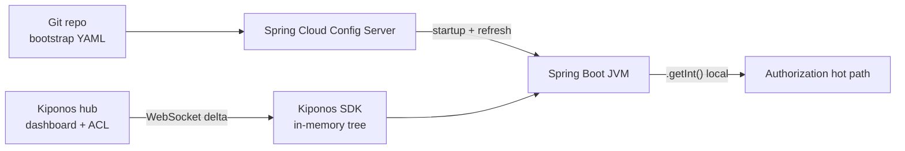

Tuesday 14:22. Payments on-call gets paged: authorization latency doubled after a partner certificate rotation. The fix is not a new Deployment — it is lowering `resilience4j.circuitbreaker.instances.partner.failureRateThreshold` from 50 to 35 and shortening `waitDurationInOpenState` while traffic is still flowing.

The platform lead opens Spring Cloud Config Server, finds the right `application-prod.yml` in Git, and starts the ritual: branch → PR → merge → Config Server webhook → `/actuator/refresh` on forty-two pods. Twenty-seven minutes later the circuit is tuned. The incident postmortem asks the question senior Spring teams keep dodging:

> "Why are we using a **Git-backed bootstrap server** for knobs that change every hour during incidents?"

[Spring Cloud Config](https://spring.io/projects/spring-cloud-config) is the right tool for **versioned wiring** — service URLs, datasource names, feature skeletons reviewed in PR. [Kiponos.io](https://kiponos.io) is the right tool for **operational parameters** your JVM reads on every request with zero network. They are complementary, not interchangeable.

## The problem — one server, two config classes mixed together

Most mature Spring shops run something like this:

```yaml
# application-prod.yml — served by Spring Cloud Config Server
spring:
  datasource:
    url: jdbc:postgresql://payments-primary:5432/payments
resilience4j:
  circuitbreaker:
    instances:
      partner:
        failureRateThreshold: 50
        waitDurationInOpenState: 30s
limits:
  tenant_acme:
    rpm: 5000
```

`@ConfigurationProperties` binds these at startup. `@RefreshScope` can recreate some beans after `/actuator/refresh`, but:

- **Hot-path reads** still often go through refreshed beans — not a dedicated local cache contract
- **Refresh** recreates scoped beans — risky under load on connection pools and filters
- **Every ops tweak** is a Git commit + Config Server round-trip + actuator broadcast
- **Python workers** and **non-Spring services** do not speak the same config dialect

The pain is not Spring Cloud Config being bad. The pain is **operational floats living in the same lifecycle as bootstrap wiring**.

## What teams believe vs production reality

| Belief | Production reality |
|--------|-------------------|
| "Config Server gives us live config" | It gives **versioned remote YAML** — refresh still recycles beans |
| "Git history covers all audit needs" | Incident knobs need **actor + timestamp** in minutes, not commit archaeology |
| "One Config Server for the whole estate" | JVM + Python + batch jobs need **one hub**, not Spring-only HTTP |
| "`/actuator/refresh` is fast enough" | Under saturation, context refresh causes **GC spikes and missed SLAs** |
| "We will split bootstrap later" | Three years later, `application-prod.yml` has 400 mixed keys |

## The Aha

**Spring Cloud Config owns bootstrap desired state. Kiponos owns operational runtime knobs.** Keep JDBC URLs and service discovery in Git via Config Server. Move thresholds, limits, timeouts, and cross-service coordination trees into a live hub the SDK reads locally — no refresh, no pod recycle.

## What Kiponos.io is in a Spring Cloud estate

Kiponos is a real-time configuration hub. Your Java SDK connects once at startup over WebSocket, loads a typed tree for a profile path like `['payments']['v2']['prod']['live']`, and serves `getInt()` / `getBool()` from **in-process memory**. Dashboard edits arrive as **delta patches** — changing `partner.failure_rate_threshold` does not retransmit the whole tree.

Profile path is the environment boundary — not a Git label fork per micro-tweak:

```
['payments']['v2']['prod']['live']
```

Spring Cloud Config still delivers `spring.datasource.url` and `kiponos.team-id` at bootstrap. Everything under `payments_ops/` is hub-native.

## Architecture — bootstrap vs live layer



1. **Bootstrap** — Config Server → `application.yml` keys for wiring and Kiponos credentials.
2. **Connect** — SDK handshake once per process.
3. **Operate** — SRE edits `payments_ops/resilience/partner/failure_rate_threshold` in dashboard.
4. **Read** — next `authorize()` sees new threshold — no `/actuator/refresh`.

## Config tree (operational layer only)

```yaml
payments_ops/
  resilience/
    partner/
      failure_rate_threshold: 35
      wait_duration_open_ms: 20000
      permitted_calls_half_open: 8
    inventory:
      failure_rate_threshold: 45
      wait_duration_open_ms: 45000
  limits/
    default/
      rpm: 1200
      burst: 200
    tenant_acme/
      rpm: 5000
      burst: 800
  fraud/
    block_score: 85
    review_score: 70
    velocity_per_hour: 12
  routing/
    primary_processor: stripe
    fallback_processor: adyen
```

## Java integration — Spring Boot 3 + Config Server coexistence

Keep Config Server for bootstrap; add Kiponos for ops reads.

```java
@Configuration
public class KiponosConfig {

    @Bean
    public Kiponos kiponos(
            @Value("${kiponos.team-id}") String teamId,
            @Value("${kiponos.access-key}") String accessKey,
            @Value("${kiponos.profile-path}") String profilePath) {
        return Kiponos.builder()
                .teamId(teamId)
                .accessKey(accessKey)
                .profilePath(profilePath)
                .build();
    }
}
```

`kiponos.team-id`, `kiponos.access-key`, and `kiponos.profile-path` live in Git via Config Server. Operational floats do not.

```java
@Service
public class AuthorizationService {

    private final Kiponos kiponos;

    public AuthorizationService(Kiponos kiponos) {
        this.kiponos = kiponos;
    }

    public Decision authorize(Transaction txn, int riskScore) {
        int blockScore = kiponos.path("payments_ops", "fraud").getInt("block_score");
        if (riskScore >= blockScore) {
            return Decision.block();
        }
        int threshold = kiponos.path("payments_ops", "resilience", "partner")
                .getInt("failure_rate_threshold");
        if (partnerCircuit.failureRate() > threshold / 100.0) {
            return Decision.degrade();
        }
        return Decision.approve();
    }
}
```

React to deltas for infrastructure binds — not on every request:

```java
@Component
public class LiveResilienceBinder {

    private final Kiponos kiponos;
    private final CircuitBreakerRegistry breakers;

    public LiveResilienceBinder(Kiponos kiponos, CircuitBreakerRegistry breakers) {
        this.kiponos = kiponos;
        this.breakers = breakers;
        kiponos.afterValueChanged(this::onChange);
    }

    private void onChange(ValueChange change) {
        if (change.path().startsWith("payments_ops/resilience/partner")) {
            breakers.circuitBreaker("partner").reset();
        }
    }
}
```

## Python integration — same hub, no Spring

Your fraud scoring worker should not fork YAML per environment:

```python
import os
from kiponos import Kiponos

os.environ["KIPONOS_PROFILE"] = "['payments']['v2']['prod']['live']"
kiponos = Kiponos.create_for_current_team()

def should_block(risk_score: int) -> bool:
    block_score = kiponos.path("payments_ops", "fraud").get_int("block_score", 85)
    return risk_score >= block_score

def partner_failure_threshold() -> int:
    return kiponos.path("payments_ops", "resilience", "partner").get_int(
        "failure_rate_threshold", 50
    )
```

Java authorization and Python scoring read the **same tree** — Config Server never had a clean answer for that.

## Real scenarios

| Event | Spring Cloud Config alone | Config Server + Kiponos |
|-------|---------------------------|-------------------------|
| Partner brownout at peak | Git PR + refresh on 42 pods | Dashboard tweak → delta → local read |
| Black Friday tenant limits | Pre-provision YAML branches | `limits/tenant_acme/rpm` live |
| Fraud analyst raises block score | Wait for release train | `fraud/block_score` in seconds |
| Python scorer must match Java | Duplicate YAML in two repos | One profile path, two SDKs |
| Audit "who changed prod at 2:14?" | `git blame` on shared file | Hub change log with actor |

## Performance — why the split matters on the hot path

- **Config Server fetch** — HTTP on bootstrap/refresh; not designed for per-transaction reads
- **Kiponos `getInt()`** — in-process lookup; microseconds on authorization path
- **Delta updates** — one key patch; no 40 KB YAML re-parse per change
- **One WebSocket per JVM** — not one Config Server poll per service instance per minute
- **Python + Java** — same delta stream; no second config technology on the hot path

## Honest comparison table

| Criterion | Spring Cloud Config | Kiponos | Honest verdict |
|-----------|---------------------|---------|----------------|
| Git-reviewed bootstrap | **Excellent** | Bootstrap keys only | Keep SCC for wiring |
| Sub-second incident tweak | Slow (Git + refresh) | **Dashboard delta** | Kiponos for ops knobs |
| Hot-path read latency | Bean property access after refresh | **Local SDK cache** | Kiponos on request path |
| Non-Spring consumers | Awkward (raw HTTP) | **Java + Python SDK** | Kiponos for polyglot |
| Audit via commit history | **Native** | Hub log + optional Git sync | Use both |
| Self-hosted / air-gap | **You operate Git + server** | Managed hub or private deploy | Depends on compliance |
| Numeric thresholds & trees | YAML blobs in Git | **First-class tree** | Kiponos for floats |
| Spring ecosystem fit | **Native** | Spring Boot 2/3 integration | Complementary |

## When not to use Kiponos

| Use case | Better tool |
|----------|-------------|
| Datasource URL, Kafka bootstrap servers | Spring Cloud Config + Git |
| Encrypted secrets rotation | Vault, sealed-secrets |
| Replica count, Ingress rules | GitOps (Argo CD / Flux) |
| Replacing your entire Config Server on day one | Phased migration — bootstrap stays in Git |

## Getting started (15 minutes) — pilot one service

1. Keep Spring Cloud Config Server unchanged for `application-*.yml` bootstrap.
2. [Create TeamPro at kiponos.io](https://kiponos.io) — profile `['payments']['v2']['prod']['live']`.
3. Move **three** keys out of Git: one circuit threshold, one tenant RPM, one fraud score.
4. Add `sdk-boot-3` dependency and `KiponosConfig` bean; wire hot-path `getInt()`.
5. Game day: measure tweak latency — dashboard edit vs PR + `/actuator/refresh`.

## Further reading

- [Developer Quickstart](https://github.com/kiponos-io/kiponos-io/blob/master/docs/devto-getting-started-developer-guide.md)
- [Product tour](https://dev.to/kiponos/getting-started-with-kiponosio-p5k)
- [GETTING-STARTED.md](https://github.com/kiponos-io/kiponos-io/blob/master/docs/GETTING-STARTED.md)
- [Spring Boot beyond @RefreshScope](https://github.com/kiponos-io/kiponos-io/blob/master/docs/devto-springboot-beyond-refresh-scope.md)
- [Rate limits & circuit breakers live](https://github.com/kiponos-io/kiponos-io/blob/master/docs/devto-rate-limits-circuit-breakers.md)
- [github.com/kiponos-io/kiponos-io](https://github.com/kiponos-io/kiponos-io)

---

*Kiponos.io — Spring Cloud Config for wiring. Live hub for how production behaves this hour.*