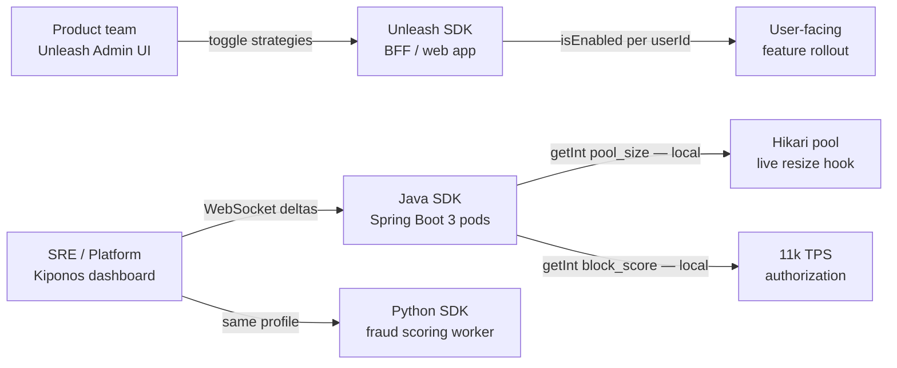

Thursday 14:22. Platform finished migrating to **self-hosted Unleash** — feature toggles in Git, gradual rollout strategies, activation strategies per `userId` and `tenantId`. The mobile team loves it. Then incident response hits: a card-testing ring triggers fraud pages, the payments circuit needs `failure_rate_threshold` at 30, connection pools are exhausted, and ops wants `tomcat.max_threads` and `hikari.maximum_pool_size` bumped **without** a rolling restart across twelve Spring Boot pods.

The platform lead suggests:

> "Create Unleash toggles `fraud_strict_mode` and `high_pool_size` — flip them for everyone."

The JVM performance owner disagrees:

> "Unleash decides **whether a feature is on for a user segment**. I need **numeric pool sizes and fraud floats** that every pod reads locally at 11k TPS — not boolean toggles with rollout strategies."

[Unleash](https://www.getunleash.io) is a mature **open-source feature toggle** platform — self-hosted control, gradual rollouts, stickiness by user, and a clean OSS story for product teams. [Kiponos.io](https://kiponos.io) is a **live operational config hub** — typed nested trees, WebSocket deltas, local reads in Java Spring Boot 3 and Python. Run Unleash for **what features users see**; Kiponos for **how services behave under load**.

## The problem — boolean toggles standing in for operational knobs

Typical Unleash integration for product features:

```java
// Correct — user-segment feature toggle
UnleashContext context = UnleashContext.builder()
        .userId(customerId)
        .addProperty("tenantId", tenantId)
        .build();

if (unleash.isEnabled("new_dashboard_v2", context)) {
    return renderV2();
}
```

The anti-pattern appears when ops keys land in the same system:

```yaml
# application.yml — still static; "fix" is more toggles
spring:
  datasource:
    hikari:
      maximum-pool-size: 20   # needs live bump during traffic spike
```

```java
// Anti-pattern — boolean toggle as numeric stand-in
if (unleash.isEnabled("high_pool_size_mode")) {
    return 40;  // magic number in code
}
return 20;
```

Pain points:

- **Booleans are not floats** — `block_score = 82` is not `fraud_strict_mode = true`
- **Rollout strategies assume identity** — circuit thresholds are **global system state**
- **No nested tree** — `resilience/payments/partner_a/failure_rate_threshold` becomes `partner_a_circuit_strict` toggle soup
- **Self-hosted ops burden** — Unleash Postgres + edge proxy is justified for **product flags**; stuffing incident knobs there pollutes the toggle catalog
- **Python batch workers** — no shared ops tree with Java services without custom sync

Unleash is excellent OSS for **gradual feature exposure**. It is the wrong shape for **operational configuration trees**.

## What teams believe vs production reality

| Belief | Production reality |
|--------|-------------------|
| "Feature toggles can cover all runtime config" | Booleans **cannot represent** fraud scores and pool sizes |
| "Self-hosted Unleash is free so use one system" | Postgres HA + upgrades have **real cost**; scope creep hurts |
| "Gradual rollout strategies fit everything" | Circuit thresholds need **instant global** change, not 10% of users |
| "Toggle naming is good enough structure" | `fraud_strict_v3_prod` keys **do not compose** across services |
| "We will add Spring Cloud Config for numbers" | Now **Unleash + Config Server + YAML** for one platform |

## The Aha

**Unleash toggles gate product features per user segment with gradual rollout. Kiponos trees hold operational knobs — floats, nested paths, shared cross-service state — with local reads on the hot path.** Keep `new_dashboard_v2` in Unleash with stickiness. Move `block_score`, `maximum_pool_size`, and `failure_rate_threshold` to Kiponos.

## What Kiponos.io is alongside self-hosted Unleash

Kiponos is a real-time configuration hub. SDKs connect via WebSocket, load profile `['platform']['services']['prod']['live']`, and mirror the tree in memory. Edit in dashboard → delta → next `getInt()` in any pod — **no restart, no toggle flip redeploy, no refresh scope**.

Unleash remains your **OSS feature-flag control plane** for product. Kiponos becomes your **ops config plane** for values that change during incidents and capacity events — same hub for Java APIs and Python workers.

## Architecture — Unleash product toggles vs Kiponos ops hub



Self-hosted Unleash stays on **user-bound** paths. Kiponos serves **system-bound** values both runtimes share.

## Config tree — ops structure Unleash was not designed to hold

```yaml
fraud/
  thresholds/
    block_score: 82
    review_score: 67
    velocity_per_hour: 16
    strict_mode_multiplier: 1.15
resilience/
  payments/
    failure_rate_threshold: 30
    wait_duration_open_ms: 24000
    permitted_calls_half_open: 10
  partner_stripe/
    failure_rate_threshold: 25
    slow_call_rate_threshold: 0.35
runtime/
  tomcat/
    max_threads: 220
    accept_count: 180
  hikari/
    maximum_pool_size: 36
    minimum_idle: 12
    connection_timeout_ms: 4500
ml/
  scoring/
    batch_size: 64
    worker_concurrency: 8
    model_version: v3.2.1
unleash_bridge/
  # Document toggles that stay on Unleash
  new_dashboard_v2: unleash_owned
  beta_export_csv: unleash_owned
```

## Java integration — pools and fraud on local reads

```java
@Configuration
public class KiponosConfig {

    @Bean
    public Kiponos kiponos(
            @Value("${kiponos.team-id}") String teamId,
            @Value("${kiponos.access-key}") String accessKey,
            @Value("${kiponos.profile-path}") String profilePath) {
        return Kiponos.builder()
                .teamId(teamId)
                .accessKey(accessKey)
                .profilePath(profilePath)
                .build();
    }
}
```

```java
@Service
public class FraudDecisionService {

    private final Kiponos kiponos;

    public FraudDecisionService(Kiponos kiponos) {
        this.kiponos = kiponos;
    }

    public FraudDecision evaluate(String panHash, int riskScore, int hourlyVelocity) {
        var fraud = kiponos.path("fraud", "thresholds");
        int blockScore = fraud.getInt("block_score");
        int velocityLimit = fraud.getInt("velocity_per_hour");

        if (hourlyVelocity > velocityLimit) {
            return FraudDecision.block("velocity_exceeded");
        }
        if (riskScore >= blockScore) {
            return FraudDecision.block("score_exceeded");
        }
        return FraudDecision.allow();
    }
}
```

Resize Hikari when ops bumps pool size — bind to config change:

```java
@PostConstruct
void bindPoolKnobs() {
    kiponos.afterValueChanged(change -> {
        if (change.getPath().startsWith("runtime/hikari/maximum_pool_size")) {
            hikariDataSource.setMaximumPoolSize(change.getNewValueAsInt());
        }
    });
}
```

Product feature — keep Unleash where gradual user rollout belongs:

```java
public boolean showBetaExport(String userId, String tenantId) {
    UnleashContext ctx = UnleashContext.builder()
            .userId(userId)
            .addProperty("tenantId", tenantId)
            .build();
    return unleash.isEnabled("beta_export_csv", ctx);
}
```

## Python integration — fraud worker shares the ops tree

```python
import os
from kiponos import Kiponos

os.environ["KIPONOS_PROFILE"] = "['platform']['services']['prod']['live']"
kiponos = Kiponos.create_for_current_team()

def score_batch(transactions: list[dict]) -> list[int]:
    batch_size = kiponos.path("ml", "scoring").get_int("batch_size", 64)
    block_score = kiponos.path("fraud", "thresholds").get_int("block_score", 85)
    # batch scoring logic ...
    return [s for s in raw_scores]

def on_config_change(change):
    if change.path.startswith("ml/scoring/batch_size"):
        reconfigure_executor(int(change.new_value))

kiponos.after_value_changed(on_config_change)
```

Unleash has no natural home for **Python scoring workers** and **Java authorization services** sharing `fraud/thresholds/block_score` with sub-second edits during a BIN attack.

## Real scenarios

| Event | Unleash alone | Unleash + Kiponos |
|-------|---------------|-------------------|
| Gradual `new_dashboard_v2` rollout by tenant | **Native activation strategies** | Keep Unleash; unchanged |
| Traffic spike — raise Hikari pool size | Boolean toggle + hardcoded sizes | `runtime/hikari/maximum_pool_size` live |
| Processor outage — tighten circuit | New toggle + deploy | `resilience/payments/failure_rate_threshold` immediate |
| BIN attack — lower block score | Not the tool | `fraud/thresholds/block_score` in seconds |
| Tomcat thread exhaustion | Restart or static YAML | `runtime/tomcat/max_threads` with live bind |
| Python + Java aligned fraud thresholds | Custom sync job | One Kiponos profile, two SDKs |

## Performance — self-hosted toggles vs ops hub reads

- **Unleash `isEnabled()`** — context evaluation + strategy matching — ideal for **per-request product gating**
- **Unleash for global numeric state** — wrong abstraction; strategies add **needless evaluation work**
- **Kiponos `getInt()`** — pure in-memory path walk on authorization hot path
- **WebSocket deltas** — one key change propagates without redeploying Unleash definitions or Spring pods
- **Self-hosted footprint** — Unleash Postgres + API is worth it for **OSS product flags**; ops floats should not inflate toggle count
- **Polyglot** — Java Spring Boot 3 and Python workers share one hub; Unleash Python SDK exists but does not solve **nested ops trees**

## Honest comparison table

| Criterion | Unleash (OSS) | Kiponos | Honest verdict |
|-----------|---------------|---------|----------------|
| Open-source feature toggles | **Core strength** | Not a toggle server | Unleash for OSS product flags |
| Gradual user-segment rollout | **Excellent** | App bucketing if needed | Unleash wins cohort exposure |
| Self-hosted control | **Full data sovereignty** | Managed hub — evaluate policy | Depends on InfoSec |
| Numeric ops thresholds | Boolean workarounds | **First-class** | Kiponos for floats |
| Nested cross-service config trees | Flat toggle names | **Hierarchical paths** | Kiponos for platform ops |
| Hot-path read at 11k TPS | Toggle evaluation | **Local cache** | Kiponos on money path |
| Live pool / thread tuning | Not designed for this | **`afterValueChanged` binds** | Kiponos for JVM knobs |
| Java + Python same ops hub | Partial | **Both SDKs** | Kiponos for polyglot ops |
| Stickiness per userId | **Native** | Application concern | Unleash for product |
| Operational cost | Self-host Postgres + upgrades | Team/hub pricing | Scope each system narrowly |

## When not to use Kiponos

| Use case | Better tool |
|----------|-------------|
| Gradual feature rollout with user stickiness | **Unleash** (or SaaS equivalent) |
| Open-source feature toggle server on-prem | **Unleash** |
| Kill-switch boolean for a UI feature | **Unleash** |
| Bootstrap secrets and DB passwords | Vault / K8s Secrets |
| Infrastructure desired state | GitOps / Terraform |

## Getting started (15 minutes) — keep Unleash for product only

1. Audit Unleash toggle catalog: mark each as **user-facing feature** vs **misplaced ops knob**.
2. [TeamPro at kiponos.io](https://kiponos.io) — profile `['platform']['services']['prod']['live']`.
3. Migrate **three ops keys** off boolean toggles: `block_score`, `maximum_pool_size`, one `failure_rate_threshold`.
4. Wire Java `FraudDecisionService` and Python scoring worker to the same profile; add Hikari bind hook.
5. Document RFC: *"Unleash owns user-segment feature toggles; Kiponos owns operational config trees."*

## Further reading

- [Developer Quickstart](https://github.com/kiponos-io/kiponos-io/blob/master/docs/devto-getting-started-developer-guide.md)
- [Product tour](https://dev.to/kiponos/getting-started-with-kiponosio-p5k)
- [GETTING-STARTED.md](https://github.com/kiponos-io/kiponos-io/blob/master/docs/GETTING-STARTED.md)
- [Feature flags vs config hub (architecture)](https://github.com/kiponos-io/kiponos-io/blob/master/docs/devto-arch-feature-flags-vs-config-hub.md)
- [Kiponos vs LaunchDarkly](https://github.com/kiponos-io/kiponos-io/blob/master/docs/devto-vs-launchdarkly-feature-flags.md)
- [Tomcat max threads Aha](https://github.com/kiponos-io/kiponos-io/blob/master/docs/devto-aha-tomcat-threads.md)
- [Fraud payment routing](https://github.com/kiponos-io/kiponos-io/blob/master/docs/devto-fraud-payment-routing.md)
- [github.com/kiponos-io/kiponos-io](https://github.com/kiponos-io/kiponos-io)

---

*Kiponos.io — Unleash for which users get the feature. Live hub for how many threads and how hard fraud blocks.*