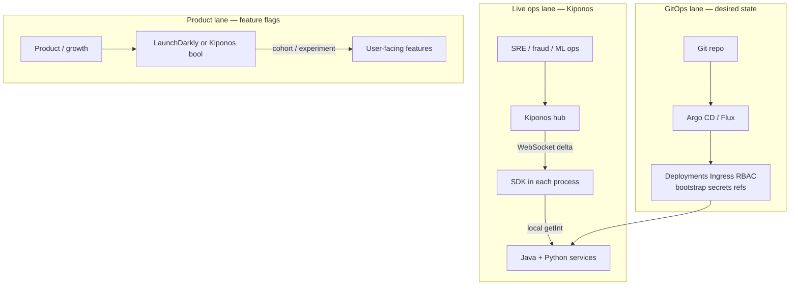

Quarterly architecture review. The diagram has **four overlapping boxes**: Argo CD for cluster state, Spring Cloud Config for YAML, LaunchDarkly for flags, and a homegrown Redis layer "for the floats." Every incident becomes a debate about **which box owns the knob** that just caught fire.

New platform engineer asks the question everyone hesitates to answer:

> "We have GitOps. Why do we also need live config? And where do feature flags fit?"

There is a clean answer — not one tool to rule them all, but **three config classes** with different **latency**, **ownership**, and **audit** requirements:

| Class | Question it answers | Typical owner |
|-------|---------------------|---------------|
| **GitOps desired state** | What should the platform look like? | Platform / SRE |
| **Live operational config** | How should services behave right now under load? | SRE / fraud / on-call |
| **Feature flags** | Which users see which product behavior? | Product / growth |

[Kiponos.io](https://kiponos.io) owns the **middle lane** — operational trees with zero-latency Java and Python reads. GitOps and feature flags stay in their lanes.

## The problem — config sprawl without a decision framework

Without explicit boundaries, teams default to whichever tool was purchased first:

```yaml
# values-prod.yaml — GitOps Helm chart (mixed classes — anti-pattern)
replicaCount: 12
ingress:
  host: api.example.com
resilience4j:
  circuitbreaker:
    instances:
      payments:
        failureRateThreshold: 50   # operational — wrong home
features:
  newCheckout: true                # product — debatable home
```

```java
// application code — fourth source of truth
private static final int BLOCK_SCORE = 90;
```

Incident at 2 PM: fraud needs `block_score` 90 → 82. Someone opens a GitOps PR. Product simultaneously wants checkout canary 5% → 10%. Platform rotates a TLS cert via cert-manager. **Three tools, three latencies, one angry CFO on the bridge.**

## What teams believe vs production reality

| Belief | Production reality |
|--------|-------------------|
| "GitOps covers all config" | Git is for **desired state**, not sub-minute ops knobs |
| "We will use flags for everything" | Fraud thresholds are not **cohort experiments** |
| "ConfigMaps are live config" | Mount + rollout = **minutes**; merges ops with infra |
| "One more Redis layer unifies floats" | You built a **fourth** system without dashboard or ACL |
| "Architecture diagrams are enough" | Without RFC **boundaries**, sprawl returns every quarter |

## The Aha

**Assign every key to a config class before assigning a tool.** GitOps reconciles cluster desired state. Feature flags (or product booleans in Kiponos) decide user-visible experiments. Kiponos holds operational floats every service reads locally — thresholds, limits, timeouts, saga coordination, ML batch sizes.

## What Kiponos.io owns in the three-lane model

Kiponos is a real-time configuration hub for the **operational lane**:

- Profile paths per environment: `['payments']['prod']['live']`
- WebSocket deltas → in-memory SDK tree
- Local `get*()` on hot path — Java Spring Boot 2/3 and Python
- Dashboard ACL for on-call and domain owners (fraud, ML ops)
- Optional product booleans (`features/new_checkout_enabled`) if you consolidate SDKs

It does **not** replace Argo CD, Terraform, or LaunchDarkly's cohort targeting — unless you consciously simplify.

## Architecture — three lanes, one reference diagram



## Decision matrix — where does this key live?

| Key example | Lane | Tool | Change latency |
|-------------|------|------|----------------|
| `replicaCount: 12` | GitOps | Helm + Argo | PR + reconcile (minutes) |
| `ingress.host` | GitOps | Kustomize | PR + reconcile |
| `fraud.block_score` | Live ops | **Kiponos** | Seconds (dashboard) |
| `hikari.maximum_pool_size` | Live ops | **Kiponos** | Seconds + binder |
| `saga.inventory.timeout_ms` | Live ops | **Kiponos** | Seconds |
| `new_checkout for 5% of users` | Product | **LaunchDarkly** or bool + bucketing | Experiment cadence |
| `ml.embedding.batch_size` | Live ops | **Kiponos** | Seconds |
| TLS certificate | GitOps | cert-manager | Automated renew |
| API keys / DB passwords | Secrets | Vault / sealed-secrets | Rotation policy |

**Rule of thumb:** if the change is triggered by **production behavior** (incident, load, fraud pattern) and must land in **seconds**, it is live ops. If it declares **infrastructure topology**, it is GitOps. If it targets **user cohorts** for product experiments, it is feature flags.

## Config tree — operational lane example

```yaml
payments_ops/
  fraud/
    block_score: 82
    review_score: 68
    velocity_per_hour: 15
  resilience/
    payments/
      failure_rate_threshold: 35
      wait_duration_open_ms: 25000
  limits/
    tenant_acme/
      rpm: 7000
  saga/
    inventory/
      compensation_timeout_ms: 40000
  ml/
    routing/
      primary_model: v3
      fallback_model: v2
      batch_size: 32
features/
  # Optional consolidation — or keep in LaunchDarkly
  strong_auth_required: false
```

GitOps `values-prod.yaml` retains only bootstrap:

```yaml
kiponos:
  profilePath: "['payments']['prod']['live']"
# resilience4j floats REMOVED — live in hub
```

## Java integration — operational lane

```java
@Configuration
public class KiponosConfig {

    @Bean
    public Kiponos kiponos(
            @Value("${kiponos.team-id}") String teamId,
            @Value("${kiponos.access-key}") String accessKey,
            @Value("${kiponos.profile-path}") String profilePath) {
        return Kiponos.builder()
                .teamId(teamId)
                .accessKey(accessKey)
                .profilePath(profilePath)
                .build();
    }
}
```

```java
@Service
public class PaymentOperations {

    private final Kiponos kiponos;

    public PaymentOperations(Kiponos kiponos) {
        this.kiponos = kiponos;
    }

    public Decision authorize(int riskScore) {
        int block = kiponos.path("payments_ops", "fraud").getInt("block_score");
        if (riskScore >= block) return Decision.block();

        float threshold = kiponos.path("payments_ops", "resilience", "payments")
                .getFloat("failure_rate_threshold");
        if (downstreamUnhealthy(threshold)) return Decision.degrade();

        return Decision.approve();
    }
}
```

GitOps Deployment manifest unchanged — only env for Kiponos bootstrap from K8s Secret.

## Python integration — ML routing lane

```python
import os
from kiponos import Kiponos

os.environ["KIPONOS_PROFILE"] = "['payments']['prod']['live']"
kiponos = Kiponos.create_for_current_team()

def route_model() -> str:
    routing = kiponos.path("payments_ops", "ml", "routing")
    if gpu_saturated():
        return routing.get_string("fallback_model", "v2")
    return routing.get_string("primary_model", "v3")

def batch_size() -> int:
    return kiponos.path("payments_ops", "ml", "routing").get_int("batch_size", 64)
```

Same profile as Java — **one operational lane** across runtimes.

## Real scenarios — pick the right lane

| Scenario | Wrong lane (pain) | Right lane |
|----------|-------------------|------------|
| Scale payments Deployment 10 → 20 replicas | Kiponos | **GitOps** PR |
| Fraud BIN attack — lower block score | GitOps PR (27 min) | **Kiponos** (seconds) |
| 5% checkout UI canary for logged-in EU users | Kiponos bool without targeting | **LaunchDarkly** |
| Add Redis StatefulSet to cluster | Kiponos | **GitOps** |
| Saga timeout during partner outage | ConfigMap rollout | **Kiponos** |
| Rotate sealed secret for DB password | Kiponos | **Vault / GitOps** |
| GPU saturation — shrink ML batch | Feature flag JSON | **Kiponos** |

## Performance — why lane separation matters

- **GitOps reconcile** — correct for infra; wrong latency for per-request floats
- **Feature-flag evaluation** — built for user context; expensive at 12k TPS for `block_score`
- **Kiponos operational read** — local cache; microsecond-scale beside business logic
- **ConfigMap volume mount** — kubelet sync delay; pod restart culture for many teams
- **Single SDK per process** — operational lane does not multiply tools on hot path

## Honest three-way comparison

| Criterion | GitOps | Kiponos (live ops) | Feature flags |
|-----------|--------|-------------------|---------------|
| Declarative infra desired state | **Excellent** | No | No |
| Sub-second ops knob during incident | Poor | **Excellent** | Poor fit |
| User cohort targeting | No | App logic only | **Excellent** |
| Numeric thresholds & trees | YAML in Git | **Native** | JSON hacks |
| Hot-path local read | N/A (not app config) | **SDK cache** | Network eval |
| Audit via commit history | **Excellent** | Hub log + optional Git sync | Experiment history |
| Java + Python ops sharing | Awkward | **Both SDKs** | Varies |
| Compliance "who changed prod wiring" | **Git blame** | Hub actor log | Flag audit |

## When not to use Kiponos

| Use case | Lane | Tool |
|----------|------|------|
| New microservice Deployment | GitOps | Argo CD |
| cert-manager Certificate | GitOps | Kubernetes |
| Multivariate UI experiment | Product | LaunchDarkly |
| Quarterly default wiring change | GitOps / Spring config | Git PR acceptable |

## Getting started (15 minutes) — write the RFC boundary

1. Export all config keys from Helm, Config Server, flags, and code constants.
2. Tag each: **gitops** | **live_ops** | **product_flag** | **secret**.
3. [TeamPro at kiponos.io](https://kiponos.io) — one profile per env: `['payments']['prod']['live']`.
4. Migrate **five live_ops keys** first — highest incident churn (fraud, limits, one saga timeout).
5. Publish internal doc: *"Git declares wiring; hub declares knobs; flags declare cohorts."*
6. Game day: simulate fraud spike — measure GitOps PR path vs hub path.

## Further reading

- [Developer Quickstart](https://github.com/kiponos-io/kiponos-io/blob/master/docs/devto-getting-started-developer-guide.md)
- [Product tour](https://dev.to/kiponos/getting-started-with-kiponosio-p5k)
- [GETTING-STARTED.md](https://github.com/kiponos-io/kiponos-io/blob/master/docs/GETTING-STARTED.md)
- [GitOps vs live config](https://github.com/kiponos-io/kiponos-io/blob/master/docs/devto-arch-gitops-vs-live-config.md)
- [Feature flags vs config hub](https://github.com/kiponos-io/kiponos-io/blob/master/docs/devto-arch-feature-flags-vs-config-hub.md)
- [Kiponos vs Spring Cloud Config](https://github.com/kiponos-io/kiponos-io/blob/master/docs/devto-vs-spring-cloud-config.md)
- [github.com/kiponos-io/kiponos-io](https://github.com/kiponos-io/kiponos-io)

---

*Kiponos.io — GitOps for what you deploy. Flags for who sees it. Live hub for how it runs.*